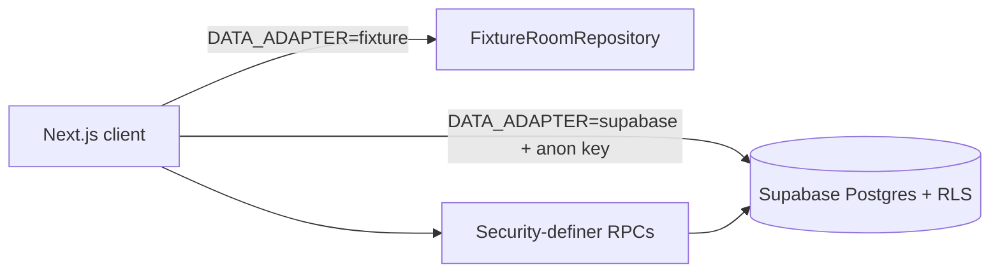

# Architecture

**Purpose:** Accurate system shape of the repository as of 2026-08-17.

---

## Stack (verified)

| Layer | Technology |
|-------|------------|
| Frontend | Next.js 15 App Router, React 19, TypeScript, Tailwind CSS, Framer Motion, Zustand |
| Data access | `RoomRepository` interface with `fixture` and `supabase` adapters |
| Backend services | Supabase (Postgres, Auth users/profiles trigger, RLS, RPCs). **No dedicated Node API server** |
| Edge Functions | **None present** in repo |
| Rate limiting | **Not implemented** |
| Tests | Vitest unit tests; optional Supabase integration tests |

## High-level diagram

## Key modules

- `src/domain` — types and transition helpers
- `src/data/repository.ts` — adapter boundary
- `src/data/room-service.ts` — UX validation / role checks (not a substitute for RLS)
- `src/data/fixture-repository.ts` / `supabase-repository.ts`
- `supabase/migrations` — schema, RLS, RPCs
- `src/app` — routes (public, enter, app, room)

## Deployment boundary

Static/SSR frontend hosting + Supabase project. Service role key must never ship to the browser.

## Auth reality

Profiles table + `handle_new_user` trigger exist. Product still primarily uses demo `enterAs` for local exploration. Full cookie session (`@supabase/ssr`) is planned, not complete.
