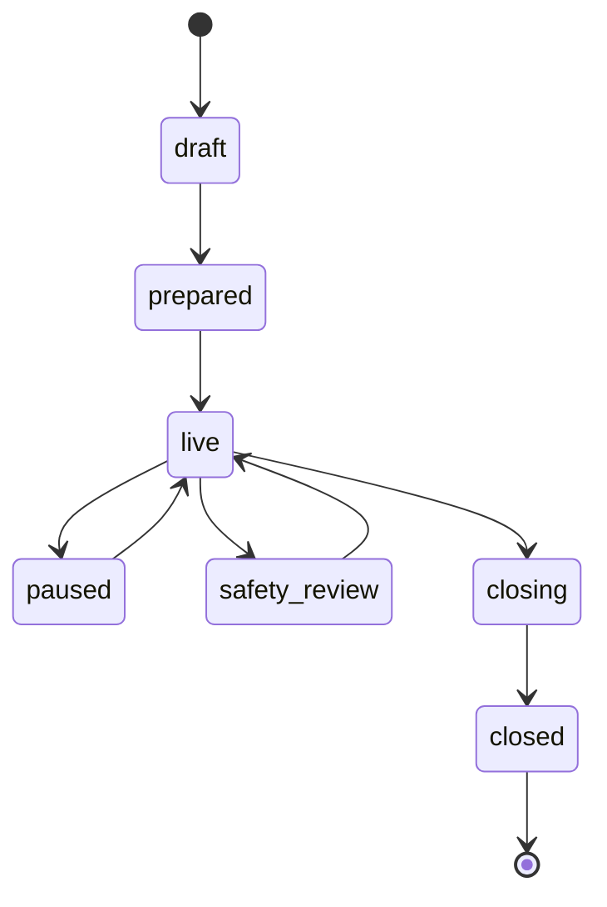

# Room lifecycle

**Purpose:** Document room status, phases, transitions, and retention behavior.

**Last verified against:** `src/domain/types.ts`, `transitions.ts`, `close_room` RPC, fixture repository (2026-08-17)

---

## Room status

```text
draft → scheduled → waiting → prepared → live ⇄ paused
                                      ↘ safety_review
                                      → closing → closed
```

Implemented enum values include: `draft`, `scheduled`, `waiting`, `prepared`, `live`, `paused`, `safety_review`, `closing`, `closed`.

Not every transition is enforced as a formal state machine in code; facilitator phase changes are allowed while not closed. Message sending is blocked when closed or in certain non-open states (see `canSendMessage`).

## Session phases (Dialogue Spine)

`opening` → `dialogue` → `caucus` → `synthesis` → `closing`  
UI also shows a final **Retained** (ledger) step when closed.

Facilitator may set phase while room is not closed.

## Close behavior

| Adapter | Behavior |
|---------|----------|
| Fixture | Sets status closed, purges messages from in-memory store, retains outcomes, appends audit |
| Supabase `close_room(uuid)` | Security-definer; facilitator only; deletes `room_messages`; sets closed metadata; audit; idempotent |

**Approved outcomes are retained.** Live messages are removed from application tables/store.

## Demo vs production meaning of “purge”

- Application-level deletion only
- Does not control browser caches, screenshots, exports, hosting logs, or database backups
- Must be disclosed to participants and partners

## Diagram


